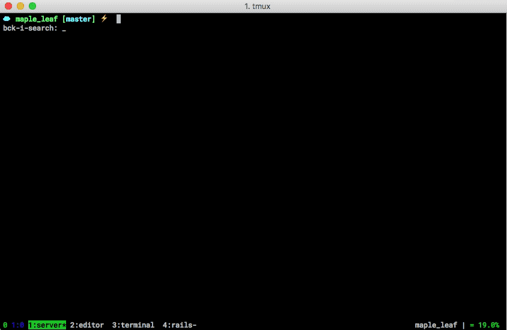

[Vim]lociraptor
===============

My personal collections of plugins and mappings for vim|neovim.

It works with tmux, and it's used for ruby, elixir, bash, and front-end development in JavaScript.

# Install

  - Install [Neovim](https://neovim.io)
  - Clone the project `git clone git@github.com:lucasprag/vimlociraptor.git ~/.config/nvim/`
  - Install [EditorConfig](http://editorconfig.org/)
  - Install [fzf](https://github.com/junegunn/fzf#installation)
  - Install [Ack](http://beyondgrep.com/install/)
  - Install [powerline fonts](https://github.com/powerline/fonts#font-families) and set one of the powerline fonts on your terminal
  - Install [Plug](https://github.com/junegunn/vim-plug)
  - run `make install`
  - run `nvim`

# Update

 - run `make update`

# Usage

It's nice to dig into other people's vim files and see how they do things. Feel free to do that.

I try to leave comments telling what each line does.

  - [plugins](plugins.vim)
  - [commands](commands.vim)
  - [configs](configs.vim)
  - [mappings](mappings.vim)

---

Cheers,

Lucas Arantes
